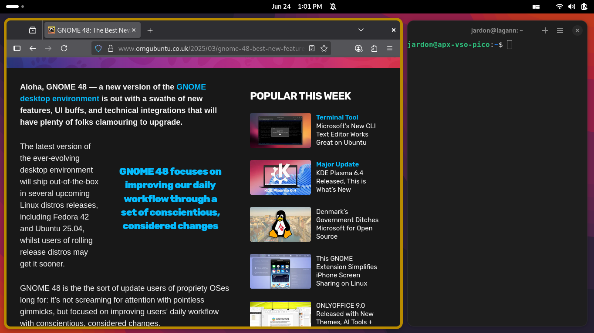

<div align="right">
  <a href="https://extensions.gnome.org/extension/8502/mosaic/">
      
  </a>
</div>
<div align="right">
  
  
</div>

<h1 align="center">
  
  <br>
  Mosaic
</h1>

Originally forked from [pop-shell](https://github.com/pop-os/shell), Mosaic is a keyboard-driven layer for GNOME Shell that was which allows for quick and sensible navigation and management of windows. It is an opinionated GNOME extension that aims for simple and intuitive window management as well as minimal configuration and sane defaults.

With pop-shell as a starting point, this project is intended to implement mosaic-style window management as defined in GNOME's [Rethinking Window Management blog post](https://blogs.gnome.org/tbernard/2023/07/26/rethinking-window-management/). These changes are not yet implemented, but are being actively developed.

[](https://raw.githubusercontent.com/jardon/gnome-mosaic/main/screenshot.png)

## Installation

GNU Make and TypeScript are also required to build the project.

Proper functionality of the shell requires modifying GNOME's default keyboard shortcuts. For a local installation, run `make local-install`.

If you want to uninstall the extension, you may invoke `make uninstall`, and then open the "Keyboard Shortcuts" panel in GNOME Settings to select the "Reset All.." button in the header bar.

> [!Important]
> If you are packaging for your Linux distribution, many features in Mosaic will not work out of the box because they require changes to GNOME's default keyboard shortcuts. A local install is necessary if you aren't packaging your GNOME session with these default keyboard shortcuts unset or changed.

## Shared Features

Features that are shared between floating and auto-tiling modes.

### Directional Keys

These are key to many of the shortcuts utilized by tiling window managers. This document will henceforth refer to these keys as `<Direction>`, which default to the following keys:

| Direction | Keys                |
| --------- | ------------------- |
| Left      | `Left Arrow` / `h`  |
| Down      | `Down Arrow` / `j`  |
| Up        | `Up Arrow` / `k`    |
| Right     | `Right Arrow` / `l` |

### Overridden GNOME Shortcuts

| Shortcut        | Action                      |
| --------------- | --------------------------- |
| `Super` + `q`   | Close window                |
| `Super` + `m`   | Maximize the focused window |
| `Super` + `,`   | Minimize the focused window |
| `Super` + `Esc` | Lock screen                 |
| `Super` + `f`   | Files                       |
| `Super` + `e`   | Email                       |
| `Super` + `b`   | Web Browser                 |
| `Super` + `t`   | Terminal                    |

### Window Management Mode

This mode is activated with `Super` + `Return`.

Window management mode activates additional keyboard control over the size and location of the currently-focused window. The behavior of this mode changes slightly based on whether you are in auto-tile mode, or in the default floating mode. In the default mode, an overlay is displayed snapped to a grid, which represents a possible future location and size of your focused window. This behavior changes slightly in auto-tiling mode, where resizes are performed immediately and overlays are only shown when swapping windows.

Activating this enables the following behaviors:

| Shortcut                         | Action                                                                                                                            |
| -------------------------------- | --------------------------------------------------------------------------------------------------------------------------------- |
| `<Direction>`                    | In default mode, this will move the displayed overlay around based on a grid. <br>In auto-tile mode, this will resize the window. |
| `Shift` + `<Direction>`          | In default mode, this will resize the overlay. <br>In auto-tile mode, this will do nothing.                                       |
| `Ctrl` + `<Direction>`           | Selects a window in the given direction of the overlay. When `Return` is pressed, window positions will be swapped.               |
| `Shift` + `Ctrl` + `<Direction>` | In auto-tile mode, this resizes in the opposite direction.                                                                        |
| `O`                              | Toggles between horizontal and vertical tiling in auto-tile mode.                                                                 |
| `~`                              | Toggles between floating and tiling in auto-tile mode.                                                                            |
| `Return`                         | Applies the changes that have been requested.                                                                                     |
| `Esc`                            | Cancels any changes that were requested.                                                                                          |

### Window Focus Switching

When not in window management mode, pressing `Super` + `<Direction>` will shift window focus to a window in the given direction. This is calculated based on the distance between the center of the side of the focused window that the window is being shifted from, and the opposite side of windows surrounding it.

Switching focus to the left will calculate from the center of the east side of the focused window to the center of the west side of all other windows. The window with the least distance is the window we pick.

### Inner and Outer Gaps

Gaps improve the aesthetics of tiled windows and make it easier to grab the edge of a specific window. We've decided to add support for inner and outer gaps, and made these settings configurable in the extension's popup menu.

### Hiding Window Title Bars

Windows with server-side decorations may have their title bars completely hidden, resulting in additional screen real estate for your applications, and a visually cleaner environment. This feature can be toggled in the extension's popup menu. Windows can be moved with the mouse by holding `Super` when clicking and dragging a window to another location, or using the keyboard shortcuts native to gnome-mosaic. Windows may be closed by pressing `Super` + `Q`, and maximized with `Super` + `M`.

## Floating Mode

This is the default mode of Mosaic, which combines traditional floating window management, with optional tiling window management features.

### Display Grid

In this mode, displays are split into a grid of columns and rows. When entering tile mode, windows are snapped to this grid as they are placed. The number of rows and columns are configurable in the extension's popup menu in the panel.

### Snap-to-Grid

An optional feature to improve your tiling experience is the ability to snap windows to the grid when using your mouse to move and resize them. This provides the same precision as entering window management mode to position a window with your keyboard, but with the convenience and familiarity of a mouse. This feature can be enabled through the extension's popup menu.

## Tiling Mode

Disabled by default, this mode manages windows using a tree-based tiling window manager. Similar to i3, each node of the tree represents two branches. A branch may be a window, a fork containing more branches, or a stack that contains many windows. Each branch represents a rectangular area of space on the screen, and can be subdivided by creating more branches inside of a branch. As windows are created, they are assigned to the window or stack that is actively focused, which creates a new fork on a window, or attaches the window to the focused stack. As windows are destroyed, the opposite is performed to compress the tree and rearrange windows to their new dimensions.

### Keyboard Shortcuts

| Shortcut      | Action                                                 |
| ------------- | ------------------------------------------------------ |
| `Super` + `O` | Toggles the orientation of a fork's tiling orientation |
| `Super` + `G` | Toggles a window between floating and tiling.          |
| `Super` + `R` | Enter window resizing mode                             |

### Customizing the Floating Window List

There is file `$XDG_CONFIG_HOME/gnome-mosaic/config.json` where you can add the following structure:

```json
{
    "class": "<WM_CLASS String>",
    "title": "<Optional Window Title>"
}
```

To find the WM_CLASS of a window, you can:

1. Use the extension's built-in exception dialog (accessible from the panel menu)
2. Check the output of `journalctl -f -o cat /usr/bin/gnome-shell` when focusing the window
3. Use `gdbus call --session --dest org.gnome.Shell --object-path /org/gnome/Shell --method org.gnome.Shell.Eval 'global.get_window_actors().map(a => a.meta_window.get_wm_class()).join(", ")'`

For example, for GNOME Settings (or GNOME Control Center), the WM_CLASS values are `gnome-control-center` and `Gnome-control-center`. Use the second value (Gnome-control-center), which gnome-mosaic will read. The `title` field is optional.

After applying changes in `config.json`, you can reload the tiling if it doesn't work the first time.

## Developers

Due to the risky nature of plain JavaScript, this GNOME Shell extension is written in [TypeScript](https://www.typescriptlang.org/). In addition to supplying static type-checking and self-documenting classes and interfaces, it allows us to write modern JavaScript syntax whilst supporting the generation of code for older targets.

Please install the following as dependencies when developing:

- [`Node.js`](https://nodejs.org/en/) LTS+ (v12+)
- Latest `npm` (comes with NodeJS)
- `npm install typescript@latest`

While working on the shell, you can recompile, reconfigure, reinstall, and restart GNOME Shell with logging with `make debug`. Note that this only works reliably on Wayland sessions when using nested mode, since restarting the shell on Wayland will exit to the login screen.

## License

Licensed under the GNU General Public License, Version 3.0, ([LICENSE](LICENSE) or https://www.gnu.org/licenses/gpl-3.0.en.html)

### Contribution

Any contribution intentionally submitted for inclusion in the work by you shall be licensed under the GNU GPLv3.
